<h3><code>karim@github ~ $ whoami</code></h3>
<table>
  <tr>
    <td valign="top"></td>
    <td valign="top"></td>
  </tr>
</table>

# Hi, I'm Karim 👋

Big Data student at ISIMS, Sfax (expected 2026) with hands-on experience in full-stack development, data pipelines, and backend systems. Currently looking for developer opportunities in Sfax, Tunisia, while continuing engineering studies.

## 🛠️ Tech Stack

## 🚀 Featured Projects

**[EMM E-commerce Platform](https://github.com/karim44266/ecommerce-backend-api)** — Full-stack e-commerce platform (NestJS, Next.js, MongoDB) with JWT/MFA authentication, a cosine-similarity recommendation engine, KPI analytics dashboard, and Docker/Nginx deployment. Split across [backend](https://github.com/karim44266/ecommerce-backend-api), [frontend](https://github.com/karim44266/ecommerce-frontend-store), and [admin dashboard](https://github.com/karim44266/ecommerce-admin-dashboard) repos.

**[Tunisia Tech Job Market Pipeline](https://github.com/karim44266/tn-job-market-pipeline)** — End-to-end data pipeline scraping live IT job postings (Python, Selenium, undetected-chromedriver to bypass Cloudflare bot protection), extracting skill/location trends, loading into SQLite, and visualizing in an interactive Streamlit dashboard. [Live demo](https://tn-job-market-pipeline0.streamlit.app/)

## 📫 Let's connect

📍 Sfax, Tunisia — open to opportunities
